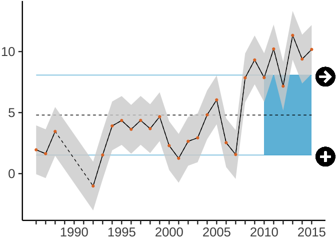
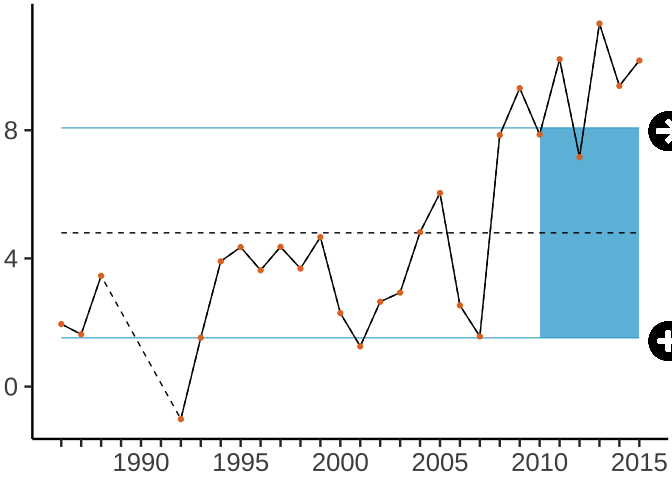
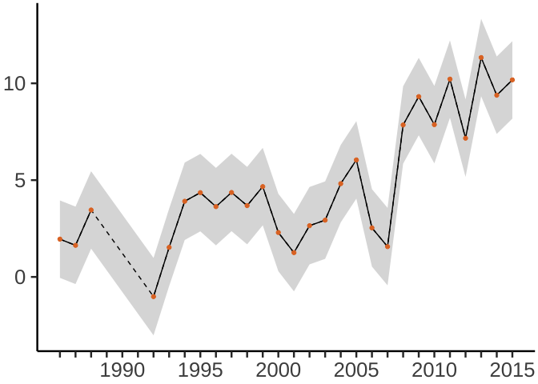

ecoidx
================

This R package consists of a set of helper datasets and plotting
functions for developing and communicating marine ecological indicators,
particularly for NOAA’s Integrated Ecological Assessment program in the
California Current.

## Load the R package

This package lives on Github, not yet CRAN, so you’ll need to run the
following once:

``` r
remotes::install_github("marinebon/ecoidx")
```

Then to load the package when using:

``` r
library(ecoidx)
```

## Datasets

Most datasets were loaded from [ERDDAP searching
“cciea”](https://oceanview.pfeg.noaa.gov/erddap/search/index.html?page=1&itemsPerPage=1000&searchFor=cciea).

You can see the available datasets for this package from the R Console
with:

``` r
data(package = "ecoidx")
```

Or look at the
[Reference](./reference/index.html#section-datasets-erddap).

The ERDDAP datasets are “evergreen” and preferred. These are loaded for
convenience, especially for quickly trying out the data wrangling and
plotting functions.

## Plotting

You can also embed plots, for example:

``` r
# example time series dataset
ts1
```

    ## # A tibble: 30 x 8
    ##     year index    Y2    SElo   SEup timeseries                metric type       
    ##    <dbl> <dbl> <dbl>   <dbl>  <dbl> <chr>                     <lgl>  <chr>      
    ##  1  1986  1.95  1.95 -0.0482  3.95  (a) Trend and recent mean NA     current.da…
    ##  2  1987  1.63  1.63 -0.368   3.63  (a) Trend and recent mean NA     current.da…
    ##  3  1988  3.46  3.46  1.46    5.46  (a) Trend and recent mean NA     current.da…
    ##  4  1989 NA    NA    NA      NA     (a) Trend and recent mean NA     current.da…
    ##  5  1990 NA    NA    NA      NA     (a) Trend and recent mean NA     current.da…
    ##  6  1991 NA    NA    NA      NA     (a) Trend and recent mean NA     current.da…
    ##  7  1992 -1.02 -1.02 -3.02    0.983 (a) Trend and recent mean NA     current.da…
    ##  8  1993  1.53  1.53 -0.473   3.53  (a) Trend and recent mean NA     current.da…
    ##  9  1994  3.91  3.91  1.91    5.91  (a) Trend and recent mean NA     current.da…
    ## 10  1995  4.35  4.35  2.35    6.35  (a) Trend and recent mean NA     current.da…
    ## # … with 20 more rows

``` r
# defaults to include all options
g <- plot_ts(ts1)
g
```

<!-- -->

``` r
cat(attr(g, "caption"))
```

    ##  The index changed by less than one standard deviation of the full time series over the last 5 years.   The mean of the last 5 years was more than one standard deviation below the mean of the full time series.

``` r
# without SElo or SEhi
g <- plot_ts(ts1[,c("year","index")])
g
```

<!-- -->

``` r
cat(attr(g, "caption"))
```

    ##  The index changed by less than one standard deviation of the full time series over the last 5 years.   The mean of the last 5 years was more than one standard deviation below the mean of the full time series.

``` r
# without x_recent, add_avg, add_icons
g <- plot_ts(ts1, x_recent=NA, add_icons=F, add_avg=F)
g
```

<!-- -->

``` r
cat(attr(g, "caption")) # empty caption without x_recent
```

## Developer

### Load dataset

1.  Place into CSV into `data-raw/` folder
2.  Create dataset. Create `get_[dataset].R` script to read, potentially
    wrangle and then load into R package as a dataset using
    `usethis::use_data()`. Run `get_[dataset].R` to generate
    `data/[dataset].rda`.
3.  Document dataset. Create `R/[dataset].R`. Run `devtools::document()`
    to create `man/[dataset].Rd`.
4.  Document package. Run `pkgdown::build_reference()` to update
    `docs/reference/index.html`.

### Develop functions

To import a library:

``` r
usethis::use_package("dplyr")
usethis::use_package("ggplot2")
```

After updating documentation:

``` r
devtools::document()
pkgdown::build_reference()
```
